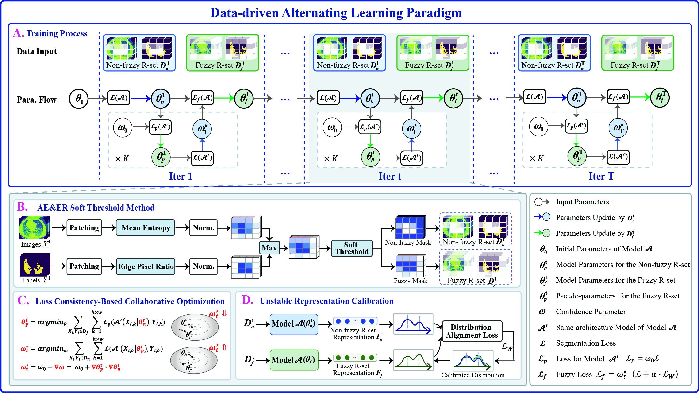








I am currently a Ph.D. candidate at the School of Software, Shandong University, supervised by Prof. [Xuemei Li](https://faculty.sdu.edu.cn/lixuemei/zh_CN/index.htm) and Prof. [Caiming Zhang](https://www.sc.sdu.edu.cn/info/1046/2286.htm). I am a member of the IC&amp;IV Lab, led by Prof. [Caiming Zhang](https://www.sc.sdu.edu.cn/info/1046/2286.htm). 

My research interests lie in computer vision and time-series analysis, with a particular focus on medical image segmentation, training stability of deep models, and data trend modeling.

# 🔥 News
- **2025.06**: &nbsp;🎉🎉 One paper is accepted by **Neural Networks**!
- **2025.04**: &nbsp;🎉🎉 One paper is accepted by **Medical Image Analysis**!
- **2025.02**: &nbsp;🎉🎉 One paper is accepted by **CVPR 2025**!
  
# 📝 Publications 

  

    

      
CVPR 2025

      
    

  

  

[Minding Fuzzy Regions: A Data-driven Alternating Learning Paradigm for Stable Lesion Segmentation](https://openaccess.thecvf.com/content/CVPR2025/papers/Fang_Minding_Fuzzy_Regions_A_Data-driven_Alternating_Learning_Paradigm_for_Stable_CVPR_2025_paper.pdf)  
**Lexin Fang**, Yunyang Xu, Xiang Ma, Xuemei Li*, Caiming Zhang.  
In *Proceedings of the IEEE/CVF Conference on Computer Vision and Pattern Recognition (**CVPR**)*, 2025.

  

  

    

      
MIA 2025

      
    

  

  

[Driven by Textual Knowledge: A Text-View Enhanced Knowledge Transfer Network for Lung Infection Region Segmentation](https://www.sciencedirect.com/science/article/abs/pii/S1361841525001720) <strong></strong>  
**Lexin Fang**, Xuemei Li*, Yunyang Xu, Fan Zhang, Caiming Zhang.  
*Medical Image Analysis (**MIA**)*, 2025.

  

  

    

      
NN 2025

      
    

  

  

[TD-HCN: A Trend-Driven Hypergraph Convolutional Network for Stock Return Prediction](https://www.sciencedirect.com/science/article/abs/pii/S0893608025006094)  
**Lexin Fang**, Tianlong Zhao, Junlei Yu, Qiang Guo, Xuemei Li*, Caiming Zhang.  
*Neural Networks (**NN**)*, 2025.
    

  

  
# 🎖 Honors and Awards
- **2018.11**: &nbsp;  **ACM-ICPC International Collegiate Programming Contest Asia Regional Contest, Silver Medal**. 
- **2018.12**: &nbsp;  **President's Scholarship**, Shandong University of Finance and Economics.
- **2019.12**: &nbsp;  **National Scholarship**, Shandong University of Finance and Economics.
- **2020.12**: &nbsp;  **Provincial Government Scholarship**, Shandong University of Finance and Economics.
- **2021.09**: &nbsp;  **First Class of Academic Scholarship**, Shandong University.

# ✨ Academic Service
- The Annual AAAI Conference on Artificial Intelligence 2026 (AAAI'26), PC Member.

# 🌐 Contact

- **Email**: &nbsp; fanglexin@mail.sdu.edu.cn 

  

